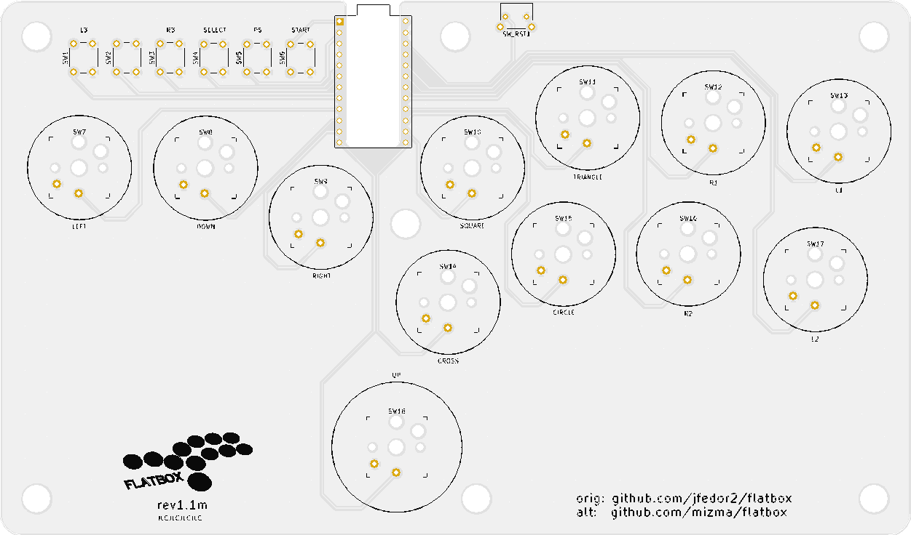

# Flatbox-ACR

_**Low profile hitbox-layout fightstick with Acrylic shell**_

_**STILL DESIGN IN PROGRESS!! FILES MAY NOT BE COMPLETE OR OTHERWISE MAY BE DEFECTIVE IN DESIGN**_

This flatbox-acr design is based on [jfedor2/flatbox](https://github.com/jfedor2/flatbox) but with a few tweaks:

* Replaced the 3D printed case with Acrylic shell, allowing to insert printed artwork.
    * or marvel at the simplistic PCB...
* modified button layout to:
    * Accomodate for the clearance needed for acrylic cutting
    * To mimic the layout of the original Hitbox button layout(not completely but closer?)
* Silk screen update
    * Added small logo instead of text (flatbox)
    * added legends for each buttons (SQUARE, CIRCLE etc.)
    * moved logo to the bottom edge to minimize see-through when adding artwork on top
* Pattern changes
    * GND Fill
    * add vias to join gnd fill
    * moved traces slightly to avoid GND islands and thin GND fills
    * added reset button for Pro Micro board

Final product when assembled will look something like the following:

**TODO: replace with actual photo**

There is currently one revision of the Flatbox-ACR.  They all use Kailh low profile (choc v1) mechanical keyboard switches.
The table below lists their main features.  See the README for each version for details on how to make them.

version | [rev1](hardware-rev1) |
------- | ------------------------- |
case dimensions | 210x123.58x10mm |
compatibility (using provided firmware) | PC, PS3 |
add-on board | Arduino Pro Micro |
onboard chip | - |
port | micro USB or USB-C |
SMT assembly required | no |
firmware | [ATmega32U4](firmware-atmega32u4) |
