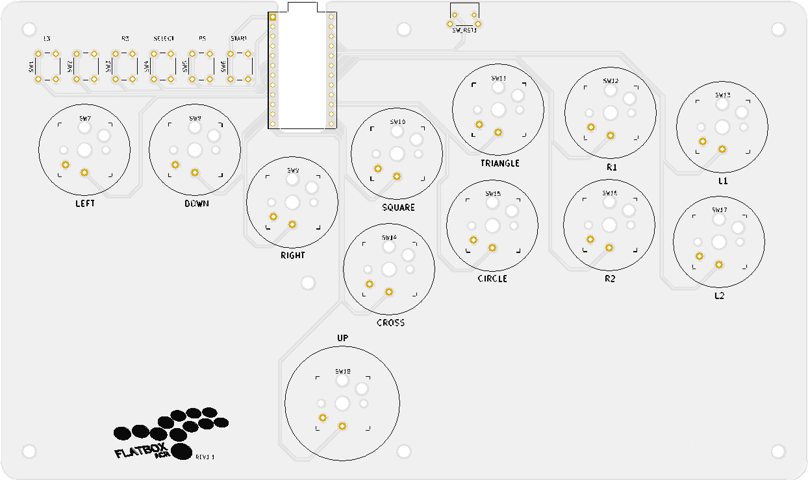

# Flatbox-ACR

_**Low profile hitbox-layout fightstick with Acrylic shell**_

_**STILL A DESIGN IN PROGRESS!! FILES MAY NOT BE COMPLETE OR OTHERWISE MAY BE DEFECTIVE IN DESIGN**_

This flatbox-acr design is based on [jfedor2/flatbox](https://github.com/jfedor2/flatbox) but with a few tweaks
(rev1.1 pcb has been redone from ground up):

* Replaced the 3D printed case with Acrylic shell, allowing to insert printed artwork.
    * or marvel at the simplistic PCB...
    * Heavily inspired by y [Mille-Feuille](https://pomegd.booth.pm/items/2685530) by [@pomegd](https://twitter.com/pomegd)
* modified button layout to:
    * Accomodate for the clearance needed for acrylic cutting
    * To mimic the layout of the original Hitbox button layout(based off of official stencil)
* Silk screen update
    * Added small logo instead of text (flatbox acr)
    * added legends for each buttons (SQUARE, CIRCLE etc.)
    * moved logo to the bottom edge to minimize see-through when adding artwork on top
* Pattern changes
    * GND Fill
    * add vias to join gnd fill
    * moved traces slightly to avoid GND islands and thin GND fills
    * added reset button for Pro Micro board
* Remodeled Button Caps to accomodate for the increased case-height

Final product when assembled will look something like the following:

**TODO: replace with actual photo**

There is currently one revision of the Flatbox-ACR.  They all use Kailh low profile (choc v1) mechanical keyboard switches.
The table below lists their main features.  See the README for each version for details on how to make them.

version | [rev1.1](hardware-rev1.1) |
------- | ------------------------- |
case dimensions | 210x125x13.6mm |
compatibility (using provided firmware) | PC, PS3, Xinput, Switch |
add-on board | Sparkfun Qwiic Pro Micro |
onboard chip | - |
port | USB-C |
SMT assembly required | no |
firmware | [ATmega32U4](firmwares_atmega32u4) |
