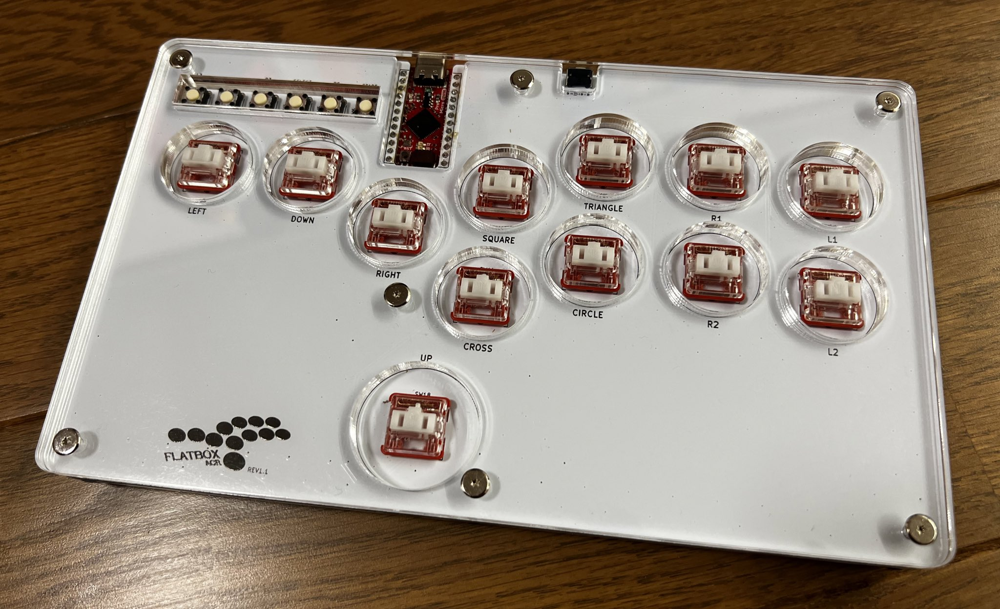
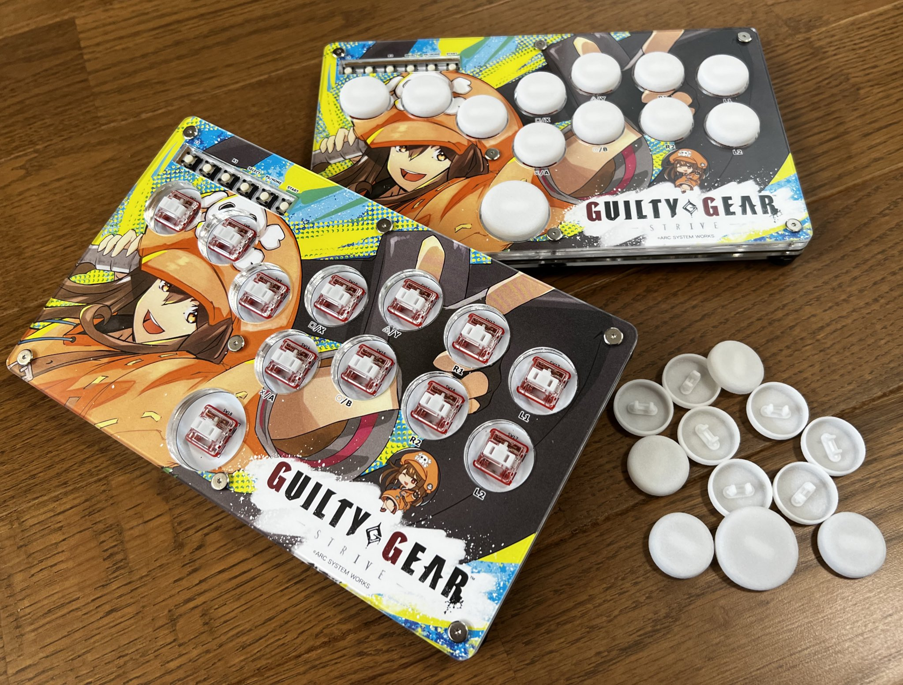

# Flatbox-ACR

_**アクリルケース型ロープロファイルHitbox風アケコン**_

Flatbox ACRは[jfedor2/flatbox](https://github.com/jfedor2/flatbox)をベースに以下の修正を加えたHitbox風アケコンです。
（rev1.1のPCBはゼロから設計し直しています）：

* 3Dプリントのケースからレーザーカットアクリル板でサンドイッチする方式に変更
    * [@pomegd](https://twitter.com/pomegd)さんの[Mille-Feuille](https://pomegd.booth.pm/items/2685530)を参考に
      させていただいております。
* ボタン配置を変更
    * アクリルのレーザーカット時のクラックを避けるためのクリアランス確保
    * オリジナルのHitboxのボタン配置を参考に配置見直し（オリジナルのステンシルを参考に配置しています）
* PCB基盤シルクの更新
    * ロゴを追加（デザイン名のオリジナルのテキストは削除）
    * 各ボタンにラベルを追加（丸、バツ、三角など）
    * カスタムアート追加にじゃまにならないようロゴを下部へ移動
* 基盤パターン変更
    * GNDフィル式に変更（特に性能は関係ないですが見た目がスッキリする為）
    * GNDフィル式にするにあたってGNDビア追加
    * 信号線のトレースを極力ピッタリ並走させGNDの浮島や半島が出来ないよう配慮
    * Pro Micro用のリセットボタンを追加（ファーム書き換えのしやすさと、リセット時のホットキーでの
      モード設定機能の活用のため）
* 強度強化とケースのサイズへの適合に合わせてボタンキャップはゼロから再設計

完成した Flatbox ACR は以下のような感じになります（現在の写真はボタンキャップ無しの状態です）：

また、[ステンシル](hardware-rev1.1/images/Flatbox-ACR-Stencil_300dpi.png) を使うことでファンアート等
を印刷したものを挟み込んでカスタムが可能となります。

(*) 上記の作例はギルティギアストライブのゲーム内キャプチャをトレースして作成したイラストとオフィシャル
ファンキットを利用しています。(©ARK SYSTEM WORKS)

現状では Flatbox ACR は一種類のみとなり、Kailh Choc v1 ロープロファイルメカニカルキーボード用スイッチを利用します。
リビジョン毎の機能は以下の表の通りとなります。詳細は各リビジョンのREADMEを参照ください。

バージョン | [rev1.1](hardware-rev1.1) |
------- | ------------------------- |
ケース外径 | 210x125x13.6mm |
互換性 (同梱ファーム利用時) | PC, PS3, Xinput, Switch |
追加基盤 | Sparkfun Qwiic Pro Micro |
オンボードIC | - |
ポート | USB-C |
表面実装要否 | 不要 |
ファーム | [ATmega32U4](firmwares_atmega32u4) |
