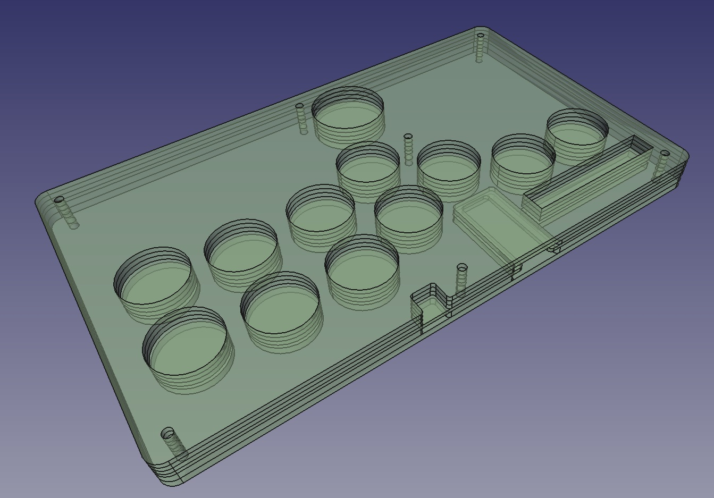

# Flatbox-ACR rev1.1

_**A WORK IN PROGRESS.  PARTS ARE NOT VERIFIED YET**_

This is rev1.1 of the Flatbox-ACR. In this version an Arduino Pro Micro is soldered onto the main PCB.

To make one you will need:

* [acrylic shell](acrylic-shell)
    * Top layers in 2mm,3mm,2mm thickness
    * Bottom layers in 3mm thickness x 2
* [the Flatbox-ACR PCB](pcb)
* Arduino Pro Micro [SparkFun Qwiic Pro Micro - USB-C (ATmega32U4)](https://www.sparkfun.com/products/15795)
* 12x Kailh low profile (choc v1) switches of your choice
    * I use Kailh Choc v1 Red Pro (Linear and low activation force: 35±10gf with actuation travel: 1.5±0.5mm)
    * Light Blue (gChoc) can be used for even lower actuation force.
* (optionally) 12x Kailh low profile hotswap sockets
* [3D printed buttoncaps](../3d-printed-buttoncaps)
* 6x 6x6x5mm tact switches
    * I Used OMRON B3F-1000 but other similar products with same footprint should work
    * Selecting switches with height higher than 7mm will result in the switch extruding from the case
* 1x 3x6x4.3 horizontal tact switch
    * https://www.newegg.com/p/2S7-01KR-035X0
    * https://shop.yushakobo.jp/collections/all-keyboard-parts/products/a1600ed-01-1
    * [schematics](images/tactile-switch_3x6x4.3.jpg)
* 7x M3 screws (length 20mm)
    * Acryl top 2mm * 2 + 3mm = 7mm
    * PCB 1.6mm
    * Acryl bottom 3mm * 2 = 6mm
    * Rubber feet screw depth = 3mm (using rubber feet below.  adjust for your part)
    * Rubber feet total depth = 8mm (using rubber feet below.  adjust for your part)
    * M3 nut height = 2mm
    * min length = 19.6mm (using rubber feet below.  adjust for your part)
    * max length = 22.6mm (using rubber feet below.  adjust for your part)
* 7x M3 nut and acompanying rubber feet
    * Rubber feet Tochigiya [TM-TK-15](https://www.monotaro.com/p/0933/2486/?displayId=5)
    * The position of the holes are intended for feet radius of less than 8mm
* a soldering iron
    * something with enough power is better 
      (i.e. [Hakko FX 600](https://www.hakko.com/japan/products/hakko_fx600_set.html))
    * I recommend changin tips to D type for most Through-hole soldering, or C type if you plan to
      solder SMT as well. (default B tips are the harder to use for most PCB soldering)
    * Use 230C ~ 250C temp recommended (can be changed if you know your way around)

## Assembly Instructions

### Ordering PCB

I used [JLCPCB](https://jlcpcb.com/).  Just upload the gerber files in [pcb](pcb) and keep most parameters default.
You may change PCB Qty and PCB Color if you like.  All other parameters should be kept the same.

### Ordering 3D Printed Buttons

If you have a 3D printer, print at your own will.  Files are found [here](../3d-printed-buttoncaps/).

* [Flatbox-ACR-ButtonCapBig.stl](../3d-printed-buttoncaps/Flatbox-ACR-ButtonCapBig.stl) 
  is used for the thumb button. 1 board needs 1 of this button.
* [Flatbox-ACR-Buttoncap.stl](../3d-printed-buttoncaps/Flatbox-ACR-ButtonCapBig.stl) is used for all ther buttons.
  1 board needs 11 of this button.
* [Flatbox-ACR-FullSetButtonCaps.stl](../3d-printed-buttoncaps/Flatbox-ACR-FullSetButtonCaps.stl) is an STL file 
  containing 1 full set of buttons (11 small and 1 big.).  If your 3D printing service allows 12 or more shells,
  it may be cheaper to print in one batch using this STL file.
    * Print size needs to be bigger than X：99.0000mm x Y： 93.5000mm x Z： 6.0000mm

Insertion portion may need to be adjusted in size for your 3D Printer and settings to fit snugly to the switch.
You may use some of the printer features but if that doesn't work, you might want to edit the original model.
Model data are found in the same directory in a [FreeCAD](https://www.freecadweb.org/) file format.

#### Materials Consideration

* Nylon
    * May be a good place to start for tensile strength and good chemical stability.
    * can be pretty strong if printed using SLS process at some printing services
    * may be prone to warping.  not good for humid places.
* UV Resin
    * Also pretty strong as a material, and stronger to humidity.
    * Maybe slightly more brittle than Nylon

### Ordering Acrylic cuts

I use [Elecrow](https://www.elecrow.com/acrylic-cutting.html) to cut acrylic.

Upload the .zip file in [acrylic-shell](acrylic-shell/) to the Elecrow Acrylic cut service to order.
.Zip file includes the dxf file and the dimentions.txt file.  PDF is just for reference.

Layer 01 and 02 should be made of 3mm thickness.

For the top 3 layers, there are two options:

1. Print Layer 03 at 2mm, 04 at 2mm x 2.
    * This will produce the flatbox-acr at 13.6mm at the body (excl. rubber feet and buttons) at the cost of reset 
      switch not being covered.
2. Print Layer 03 at 2mm, 04 at 3mm and layer 05 at 2mm.
    * This will produce the flatbox-acr at 14.6mm at the body (excl. rubber feet and buttons).  Reset switch will 
      be covered at the cost of thickness and less button extrusion. (may want to tweak the button caps to have 
      more thickness)

The original design file (FreeCAD file) can be found [here](./design_data/acryl-design/).

The Acrylic should look like the following (with PCB stacked)

(*) Above image uses two Layer 4 at 2mm (exposed reset switch but 1mm thinner)

### Assembly

1. Solder all the Choc v1 switches and the tactile switches.  make sure you populate the side with the logo.
    * If you populate the side with the logo, the parts only goes in in the correct orientation.
    * If you use the hot-swap sockets, those will go on the back. (see silk screen on back side for orientation)
2. Solder the Pro Micro Qwiic from the bottom side of the PCB up into the slit (USB socket should be between
   the cut-outs on the board, facing up)
3. stack the Acryl and PCB in following order: Layer 01, Layer 02, PCB, Layer 03, Layer 04 and Layer 05.
    * If you use 2 Layer 4s, the order should be 01, 02, 03, 04, 04.
5. Screw on the M3 screws with the nut on all 7 locations.  Rubber feet should be inserted in the 4 corners
   between the nut and the acrylic.

## License and Acknowlegements

PCB design licensed under [CC BY-SA 4.0](https://creativecommons.org/licenses/by-sa/4.0/) by mizma, derived from
[jfedor2/flatbox](https://github.com/jfedor2/flatbox) rev1.1 as of 2022/07/18

Acrylic sandwitching shell heavily inspired by [Mille-Feuille](https://pomegd.booth.pm/items/2685530) 
by [@pomegd](https://twitter.com/pomegd)

PCB design uses the following libraries or derivatives of the design:

* [jfedor2/flatbox](https://github.com/jfedor2/flatbox) by [jfedor2](https://github.com/jfedor2) ([CC BY-SA 4.0](https://creativecommons.org/licenses/by-sa/4.0/))
* [keyswitches.pretty](https://github.com/daprice/keyswitches.pretty) by [daprice](https://github.com/daprice) ([CC BY-SA 4.0](https://creativecommons.org/licenses/by-sa/4.0/))
* [ProMicroKiCad](https://github.com/Biacco42/ProMicroKiCad) by [Biacco42](https://github.com/Biacco42), derived from [teensy\_library](https://github.com/XenGi/teensy_library) by Ricardo Band ([MIT License](https://opensource.org/licenses/mit-license.php))
