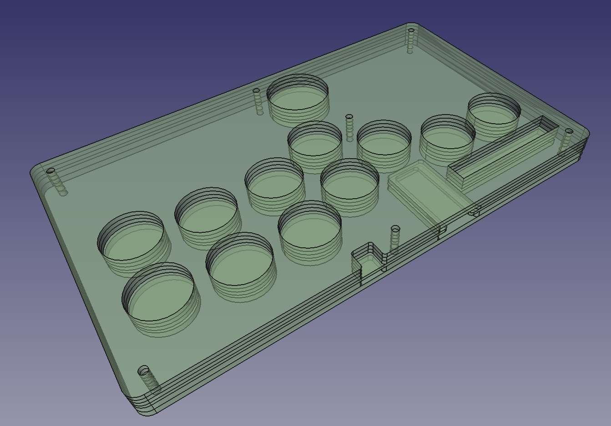

# Flatbox-ACR rev1.1

_**製作途中のため各パーツの互換性は未検証です**_

Flatbox ACR rev1.1 のリポジトリです。このバージョンでは Arduino Pro Micro をPCBに直接はんだ付けする
形で設計されています。

制作にあたって以下の部品が必要になります：

* [レーザーカットアクリル板](acrylic-shell)
    * PCBより上のレイヤーは2mm, 3mm, 2mmの厚さとなります
    * PCBより下のレイヤーは3mmｘ2枚となります
* [Flatbox-ACR 基盤](pcb)
* Arduino Pro Micro [SparkFun Qwiic Pro Micro - USB-C (ATmega32U4)](https://www.sparkfun.com/products/15795)
* お好きな Kailh ロープロファイル（choc v1）スイッチｘ１２個
    * 作者は Kailh Choc v1 Red Proのリニアタイプのキー（作動圧35±10gf、作動ストローク：1.5±0.5mm）を使用しています
        * アーケードの物に近いのがこちらか更に作動圧の低いリニアタイプになると思います。
    * Light Blue (gChoc)にすることで更に低い作動圧のものにできます
    * choc v2（キーキャップの取り付け部分が＋型のもの）は非対応となります。
* Kailh Low Profile用ホットスワップソケット（必須ではありません）
    * [こちら](https://shop.yushakobo.jp/collections/all-keyboard-parts/products/a01ps?variant=37665172553889)
      で購入できます。ソケットタイプでロープロファイル用を選択してください。
* [ボタンキャップ（3Dプリント）](../3d-printed-buttoncaps)
    * 検証でき次第 DMMマーケット出品予定
* [6x6x5mm タクトスイッチ](https://www.monotaro.com/p/4647/7961/) ｘ6個
    * 上記は OMRON製のB3F-1000ですが、同様のフットプリントの製品であれば代用可能です。
    * 基盤上面から7mm以上のものはケースからはみ出るのでそのあたりを考慮して選択してください。
* 3x6x4.3 水平式タクトスイッチ
    * https://www.newegg.com/p/2S7-01KR-035X0
    * https://shop.yushakobo.jp/collections/all-keyboard-parts/products/a1600ed-01-1
    * [schematics](images/tactile-switch_3x6x4.3.jpg)
* [M3 screws (length 20mm)](https://www.monotaro.com/p/2903/0445/) ｘ7個
    * 上面アクリル厚 2mm * 2 + 3mm = 7mm
    * 基盤厚さ 1.6mm
    * 下面アクリル厚 3mm * 2 = 6mm
    * ゴム足締め付け厚 = 3mm （下記ゴム足利用時）
    * ゴム足全高 = 8mm （下記ゴム足利用時）
    * M3 ナット厚 = 2mm （下記ナット利用時）
    * 最低長 = 19.6mm （下記ゴム足利用時）
    * 最大長 = 22.6mm （下記ゴム足利用時）
* [M3 nut](https://www.monotaro.com/p/6105/4727/) と対応ゴム足 ｘ７個
    * ゴム足は栃木屋の[TM-TK-15](https://www.monotaro.com/p/0933/2486/?displayId=5)に合わせて設計してあります。
* ハンダゴテとハンダ作業に必要な諸々
    * 十分な熱量の物をおすすめします（例 [Hakko FX 600](https://www.hakko.com/japan/products/hakko_fx600_set.html)）
    * ハンダゴテ用チップはD型かC型に変えることをおすすめします（標準で着いてくるB型は電子基板のハンダ作業には
      向いていないため失敗しやすいです）
    * ハンダゴテの温度は利用するハンダに合わせて選択してください。
        * 鉛60%ハンダであれば230℃程度
        * 鉛フリーハンダの場合は270℃程度

## 組み立て方法

### 基盤発注

[JLCPCB](https://jlcpcb.com/) 等で発注してください。[pcb](pcb)にあるzipファイル（ガーバーデータ）を基盤製作会社の
ページでアップロードすれば見積もりが出ます。JLCPCBであれば上記のガーバーデータでそのまま発注可能です。

アップロードしたら発注数と基盤の色はお好みで選択しその他はデフォルトのまま発注してください。

### ３Ｄプリント式ボタンキャップの発注

３Ｄプリンタをお持ちの方は自由にプリントしてご活用ください。STLファイルや元となるCADデータは
[こちら](../3d-printed-buttoncaps/)にあります。

* [Flatbox-ACR-ButtonCapBig.stl](../3d-printed-buttoncaps/Flatbox-ACR-ButtonCapBig.stl) 
  が親指のボタンに使われるキャップになります。一つ必要です。
* [Flatbox-ACR-Buttoncap.stl](../3d-printed-buttoncaps/Flatbox-ACR-ButtonCapBig.stl) がその他のボタンすべてに
  利用されるキャップになります。１１個必要です。
* [Flatbox-ACR-FullSetButtonCaps.stl](../3d-printed-buttoncaps/Flatbox-ACR-FullSetButtonCaps.stl) 
  が、１セットで必要になるボタンキャップを一括プリントするためのSTLファイルになります。プリント時間の短縮や
  プリントサービスでの費用削減に活用ください。
    * こちらをプリントする場合プリントサイズが X：99.0000mm x Y：93.5000mm x Z：6.0000mm 以上に対応している
      必要があります。
    * また、シェル数が１２以上に対応している必要があります。
    * こちらはDMM Makeクリエイターズマーケットで購入できるよう準備中です。

キーキャップとメカニカルキースイッチとの結合部分についてはプリンタのプリント精度等に合わせて調整が必要です。
最悪入らなかったり、ブカブカだったりしてしまうため、利用するプリンタやプリントサービスに合わせて調整してください。
調整する場合は３Ｄプリンタの設定で調整するか、同梱の[FreeCAD](https://www.freecadweb.org/)用設計データを修正してご利用ください。

また、キャップの足部分は現在の３Ｄプリンタでは難しいかなりタイトな精度が求められます。
このため、現状のモデルでは足部分を少し太めに設計してあります。ＳＬＳ方式のナイロン３Ｄプリントではそこそこ
良い結果が出ていますが、稀に太りすぎて挿入できない場合があります。
その場合は紙ヤスリ等で足の部分を徐々に削りながらサイズ調整して利用してください。

#### プリント材料について

* ナイロン（SLS方式）
    * 靭性等も比較的高くこういった部品に適しています
    * 湿度に少し弱いかもしれません
    * プリント精度は結構高め
* 光硬化式レジン
    * ナイロンよりもさらに高い硬度があり靭性も比較的高いです
    * 湿度に対しても強い傾向にあります
    * プリント精度は高いですが、二次硬化処理等の関係で少し太めに出る可能性があります

#### DMM.make クリエイターズマーケット

クリエイターズマーケットから直接オーダーできるよう準備中です。
値段は自分でSTLファイルをアップロードする場合と同じに設定してあります（マージン無し）
審査通った場合はリンクをこちらに貼り付け予定です。

### レーザーカットアクリル板の発注

作者は[Elecrow](https://www.elecrow.com/acrylic-cutting.html)様のサービスを利用しています。

上記サイトを使う場合は[acrylic-shell](acrylic-shell/)に同梱の.zipファイルをアップロードして発注してください。
.zipファイル内には発注に必要なデータ（dxfファイルとdimentions.txt）が入っています。同梱のPDFはあくまで参考です。
別で設計し直して自前でカットする場合はPDFの設計図面を参考にしてください。

Layer 01と02は3mm厚で発注してください。

レイヤー03～05については2パターンの選択肢があります。

1. Layer 03 を 2mm, 04 を 2mm x 2でカット
    * この方法の場合全体厚が1mm薄くできる代わりにリセットボタン部分の上面がアクリル板で覆われない状態になります。
      この方式ではレイヤー04を二枚重ねて使います。
2. Layer 03 を 2mm, 04 を 3mm , layer 05 を 2mmでカット
    * この方式の場合、方式１よりも1mm分厚くなりますがリセットボタン部分の上面をアクリル板で覆うことが可能です。
      ３Ｄプリントキーキャップはこちらの方式を前提に設計しています。

オリジナルの設計データは[こちら](./design_data/acryl-design/)にあります（FreeCAD用ファイル）

アクリル板とPCBをスタックした場合以下の様になります。

(*) 上記イメージでは Layer 4 を 2mm でカットしたものを二枚重ねたパターンです

### 組み立て

1. Pro Micro Qwiic USB-Cを、基盤の下側からスリットに嵌まるようにはんだ付けします（USBソケットが基盤の切り込みの
   間に来るように取り付けます）。以下の手順は作者の手法ですが他にもやり方は色々あると思うのでご自分のやりやすい
   方法を使ってみてください。
    1. まず、PCBの下面（ロゴの無い方）のスルーホールをマスキングテープで塞ぎ、安全ピン等の針で各スルーホールの
       中心に穴を空けます（こうすることでリードをハンダ付けしたときにPro Micro取り付け側にフィレットが形成される
       のを防ぎ、Pro Microをぴったりくっつけてハンダ付けできます）。
       
    2. ２～３cm程にカットした[錫メッキ軟銅線](https://www.monotaro.com/p/0523/4303/)を各穴に差し込んで表側から
       はんだ付けし、余分なリードをカットします。
       
       
       
    5. マスキングテープを剥がします。基盤裏側が基盤表面いっぱいいっぱいまでハンダが流れ込み、平らになっている
       事を確認してください。（あまりにもハンダが流れていない場合ははんだ付け時にスルーホール側をきちんと熱し
       切れていない為に起こります。壊れる部品も無いので焦らずじっくりハンダゴテで熱してからハンダを流し込む
       用作業しましょう。特にGNDピンはGNDフィル部分に熱が持っていかれるので余分に熱する必要があります。）
       
    6. Pro Microを基盤裏側に生やしたピンにはめ込み、マスキングテープで固定します。また、表面のカットしたピン
       をカバーするようにマスキングテープを貼り付けます（Pro Microをはんだ付けする際にまたリードを熱するため
       基盤側のハンダも溶けます。その際にピンが抜け落ちないよう抑えるためにマスキングテープで止めます）。
       Pro Microをピンに通す前にピンをすべてまっすぐに伸ばしておくと作業がしやすいです。後は長いリードから
       順に穴にはめ込み、引っかかったら引っかかったピンをピンセット等でずらしながら順番にスルーホールに通せば
       嵌め込むことが出来ます。
       
    7. リードにPro Microをはんだ付けします。
       
2. タクトスイッチとChoc v1スイッチを基盤表面にハンダ付けします。
    * すべて表面に差し込めば正しい方向にしかはんだ付け出来ないようになっています。
    * ホットスワップソケットを使う場合はホットスワップソケットを基盤裏面に実装してください（シルクのアウトライン
      に合うように部品を設置すればOKです）
        * ホットスワップソケットをハンダ付けする場合
            1. まず基盤側のソケット用ハンダパッドの片側に少しだけ予備ハンダをつけます。
            2. ホットスワップソケットを基盤に差し込み上から押さえつけながら予備ハンダのついた側をハンダゴテで
               熱し、仮付します。
            3. 仮付け指定ない側をハンダ付けし、その後仮付けした側に追加でハンダ付けして完全に固定したら完了です。
3. アクリル板とPCBを次の順序で重ねます： Layer 01, Layer 02, 基盤, Layer 03, Layer 04 and Layer 05.
    * Layer 4を二枚使う場合は： 01, 02, 基盤, 03, 04, 04 の順序になります。
4. M3ネジとゴム足、M3ナットを使って7箇所の固定穴を留めます。

この時点で以下のような形になるはずです。

5. 最後に３Ｄプリントしたキーキャップを取り付けて完成

### おすすめ作業その 1. アクリル板の角落とし

レーザーカットされたアクリル板の角はかなりエッジが立っており利用時に手のひらにあたって痛いので
紙やすり（４００番か２００番あた）で角をヤスリがけすると角が落ちて痛くなくなります。

### おすすめ作業その 2. 痛アケコンカスタム

以下のようにアクリル板の間にアートワークを差し込むことが可能です。

(*) 上記の作例はギルティギアストライブのゲーム内キャプチャをトレースして作成したイラストとオフィシャル
ファンキットを利用しています。(©ARK SYSTEM WORKS)

差し込みアート用のステンシルは[こちら](images/Flatbox-ACR-Stencil_300dpi.png)にあります。
ステンシルは300dpiで作成しているため、印刷時に300dpiで印刷することで概ねサイズが合う形で印刷されます
（印刷精度の関係でピッタリにはならないです）。
また[こちらのステンシル](images/Flatbox-ACR-Stencil_with_key_label_300dpi.png)を使えばPCB基盤にある
スイッチのラベルも含めた形で印刷可能です。

印刷したステンシル付きアートワークをカットする際は印刷されたステンシルガイドを使わずに、Layer 5の
アクリル板を使ってカットしてください（プリンターの印刷精度はそこまで高くないためずれてしまいます）。
カットする際はカッティングボードの上に印刷物とアクリル板をマスキングテープ等で固定すると作業がやりやすいです。

## ライセンスと謝辞

この基盤は@mizmaにより[クリエイティブ・コモンズ 表示 - 継承 4.0 国際 ライセンス](https://creativecommons.org/licenses/by-sa/4.0/)の下に提供されています。
設計は ２０２２年７月１８日にフォークされた[jfedor2/flatbox](https://github.com/jfedor2/flatbox) rev1.1をベースに
作成されています。

アクリル板サンドイッチ方式は[@pomegd](https://twitter.com/pomegd)様の[Mille-Feuille](https://pomegd.booth.pm/items/2685530) を参考に製作されています。

基盤設計では以下のライブラリや設計を参考にさせていただいております：

* [jfedor2/flatbox](https://github.com/jfedor2/flatbox)。[jfedor2](https://github.com/jfedor2)様作 ([CC BY-SA 4.0](https://creativecommons.org/licenses/by-sa/4.0/))
* [keyswitches.pretty](https://github.com/daprice/keyswitches.pretty)。[daprice](https://github.com/daprice)様作 ([CC BY-SA 4.0](https://creativecommons.org/licenses/by-sa/4.0/))
* [ProMicroKiCad](https://github.com/Biacco42/ProMicroKiCad)。[Biacco42](https://github.com/Biacco42)様作
    * [teensy\_library](https://github.com/XenGi/teensy_library) Ricardo Band様作
      ([MIT License](https://opensource.org/licenses/mit-license.php))ベースに作成
